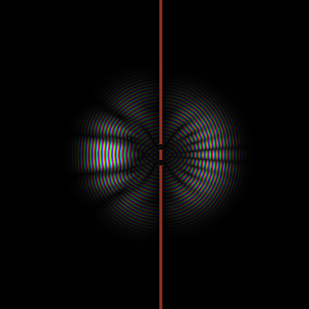

# WavePacket

The 2D time-dependent Schrödinger equation solved in real time. A quantum wave
packet hits a double slit and produces the textbook interference pattern;
tunnels through a barrier; sloshes in a harmonic trap; scatters off walls you
draw with the mouse.



## Physics

Split-step Fourier method (`ħ = m = 1`, `dx = 1`):

```
psi  →  e^{-iV·dt/2}  F⁻¹ e^{-i k²·dt/2} F  e^{-iV·dt/2}  psi
```

The Hamiltonian splits into kinetic and potential parts, each diagonal in its
own basis: the potential phase is applied pointwise in real space, the kinetic
phase pointwise in momentum space, with FFTs in between. The scheme is unitary
and second-order accurate in `dt`.

The FFT is an own iterative radix-2 implementation (bit-reversal + butterflies,
precomputed twiddles). The 2D transform is rows → blocked transpose → rows,
multithreaded across rows. No FFTW, no libraries beyond Qt.

An absorbing sponge (gentle amplitude ramp near the boundary) eats whatever
reaches the edge, so escaped waves don't wrap around.

## Visualization

Phase → hue, amplitude → brightness: you see the wavefunction itself, not just
the probability density. A probability-only view (inferno-style ramp) is one
checkbox away. The potential is overlaid in red.

## Controls

| Control | Effect |
|---|---|
| Scenario | free packet / double slit / tunnel barrier / harmonic trap / empty |
| Grid | 256² / 512² / 1024² |
| dt, Steps/frame | time resolution vs speed |
| Momentum k0 | initial packet momentum (rad/sample) |
| Packet sigma | initial packet width |
| Barrier V/E | barrier height in units of the packet's kinetic energy |
| Slit width / separation | double-slit geometry |
| LMB / RMB | draw / erase potential walls |

Norm and ms/step are shown live; the norm stays ~1 until waves reach the sponge.

## Build

```
cmake -B build -DCMAKE_BUILD_TYPE=Release
cmake --build build -j
```

Requires Qt6. C++17, Qt6 Widgets only. Run the Release build — the FFT at
512² is no fun under a debug configuration.

## Debug frame dump

`DUMP_FRAMES=N` renders N frames headlessly, saves `dump.png`, exits.

## License

MIT License

Copyright (c) 2026 Mykhailo Makarov

Permission is hereby granted, free of charge, to any person obtaining a copy
of this software and associated documentation files (the "Software"), to deal
in the Software without restriction, including without limitation the rights
to use, copy, modify, merge, publish, distribute, sublicense, and/or sell
copies of the Software, and to permit persons to whom the Software is
furnished to do so, subject to the following conditions:

The above copyright notice and this permission notice shall be included in all
copies or substantial portions of the Software.

THE SOFTWARE IS PROVIDED "AS IS", WITHOUT WARRANTY OF ANY KIND, EXPRESS OR
IMPLIED, INCLUDING BUT NOT LIMITED TO THE WARRANTIES OF MERCHANTABILITY,
FITNESS FOR A PARTICULAR PURPOSE AND NONINFRINGEMENT. IN NO EVENT SHALL THE
AUTHORS OR COPYRIGHT HOLDERS BE LIABLE FOR ANY CLAIM, DAMAGES OR OTHER
LIABILITY, WHETHER IN AN ACTION OF CONTRACT, TORT OR OTHERWISE, ARISING FROM,
OUT OF OR IN CONNECTION WITH THE SOFTWARE OR THE USE OR OTHER DEALINGS IN THE
SOFTWARE.

## Support

If you found this project interesting or useful, you can support my work:

[](https://github.com/sponsors/makarov-mm)